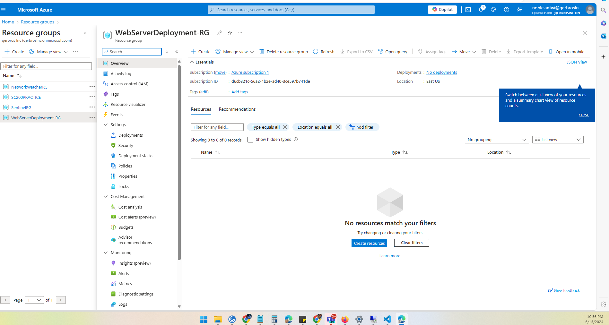
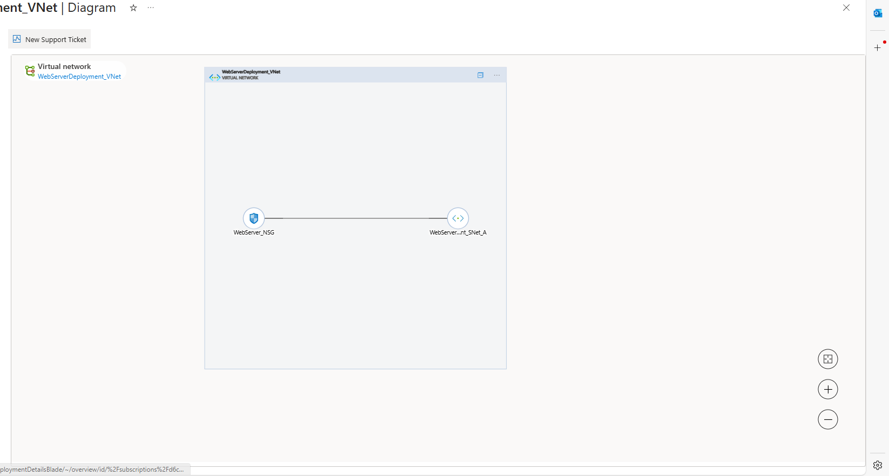
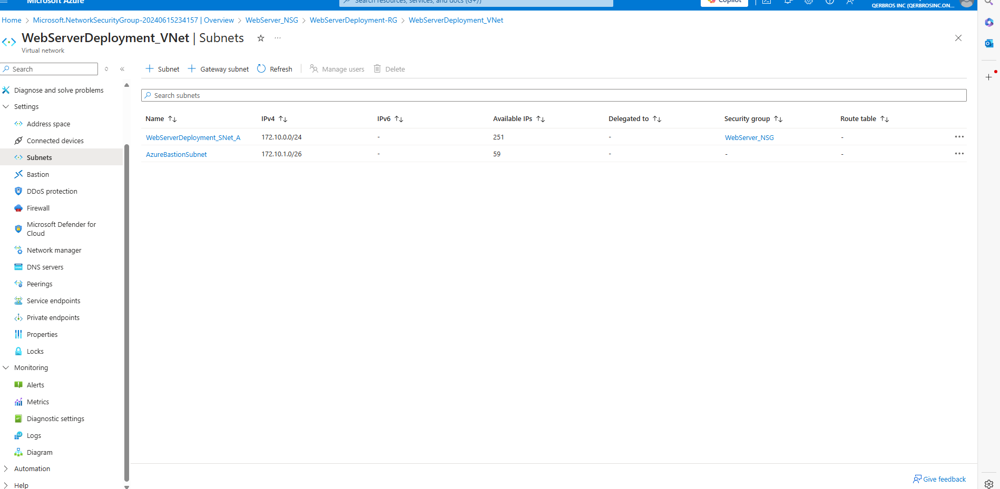
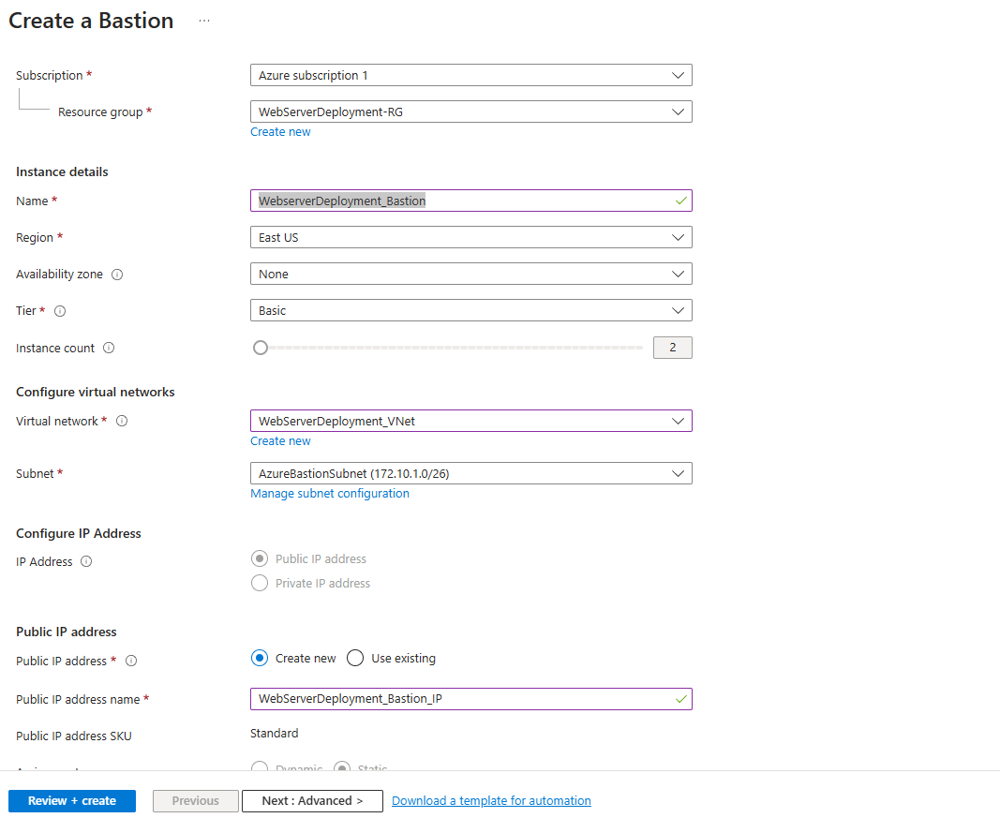
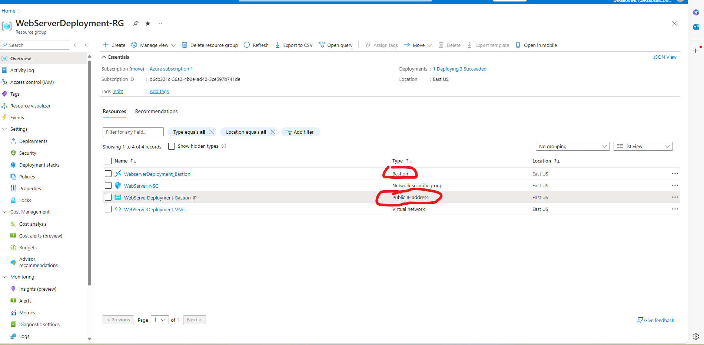
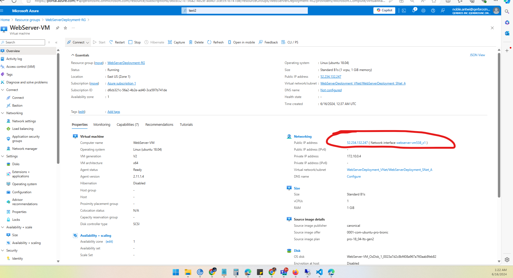
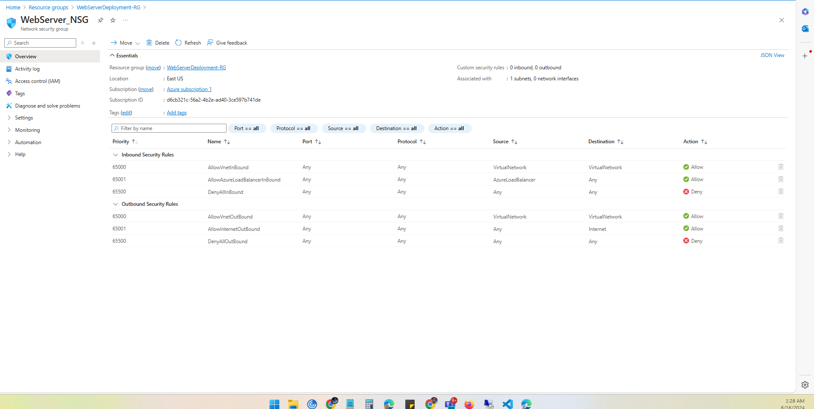
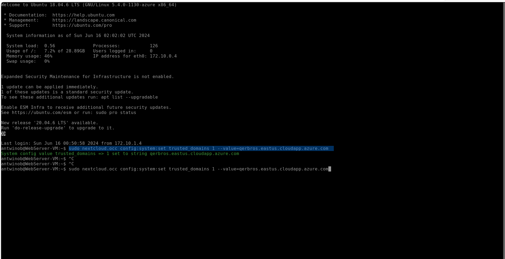
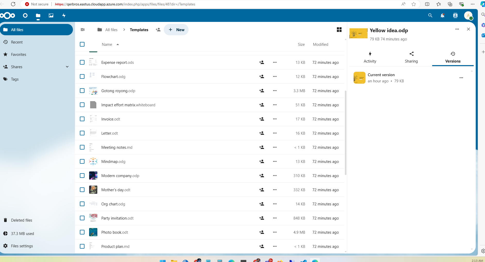

# DEPLOYING A WEB SERVER ON AN AZURE VIRTUAL MACHINE

Project-based Course Overview
Welcome!
Welcome to Azure: Create a Virtual Machine and Deploy a Web Server. This is a project-based course which should take approximately 2 hours to finish. Before diving into the project, please take a look at the course objectives and structure:

Course Objectives
In this course, we are going to focus on eight learning objectives:

Create a Resource Group

Create a Virtual Network and a subnet

Protect a subnet using a Network Security Group

Deploy Bastion to connect to a Virtual Machine

Create an Ubuntu Server Virtual Machine

Install Nextcloud by connecting via SSH using Bastion

Publish an IP

Create a DNS label

By the end of this course, you will be able to understand how the basic networking architecture in Azure works, by creating Virtual Networks, subnets, security groups and Virtual Machines. You will also learn how to use Bastion to connect to a Linux machine using SSH without exposing and external IP. You'll also learn how to expose a public IP and an HTTPS port to access your web server.

Course Structure
This course is divided into 4 parts:

Course Overview: This introductory reading material.

Azure: create a Virtual Machine and deploy a web server: This is the hands on project that we will work on.

Graded Quiz: This is the final assignment that you need to pass in order to finish the course successfully.

Project Structure
The hands on project on Azure: create a Virtual Machine and deploy a web server is divided into following tasks:

Task 1: Create a Resource Group
Task 2: Create a Virtual Network and a subnet
Task 3: Protect a subnet using a Network Security Group
Task 4: Deploy Bastion to connect to a Virtual Machine
Task 5: Create an Ubuntu Server Virtual Machine
Task 6: Install Nextcloud by connecting via SSH using Bastion
Task 7: Publish an IP
Task 8: Create a DNS label


## Task 1: Create a Resource Group

The name of the resource Group Created is **WebServerDeployment-RG**


## Task 2: Create a Virtual Network and a subnet

The name given to the Virtal Network is **WebServerDeployment_VNet**. The CIDR block for the IP selection is **172.10.0.0/16** and the default Subnet Deleted. First nealy created subnet was named *WebServerDeployment_SNet_A*


In the diagram section, bellow is how  out infratructure will look like


## Task 3: Protect a subnet using a Network Security Group
In the resource group created, i will then go and add the Network Security Group resource to it. Itsname is **WebServer_NSG**
By Default, the created NSG has three inbound rules and 3 outband rules which are 
1. Inbound Rules
   1. AllowVnetInBound. 
   2. AllowAzureLoadBalancerInBound
   3. DenyAllInBound
2. Outband Rules
   1. AllowVnetOutBound
   2. AllowInternetOutBound
   3. DenyAllOutBound

The created NSG will be added to the subnet created earlier with some modification to it later.


The new architecture will therefore change accordingly to the one below



## Task 4: Deploy Bastion to connect to a Virtual Machine
In the creation process, the purpoose was selected to be Azure Bastion and the name given to it as AzureBationServer. The CIdr is 172.10.1.0/26 making 64 IPs available for use.




Creating of the BAstion
In the processs, a new Public IP address was created which was named **WebServerDeployment_Bastion_IP**. The name given to the bation host howver is **WebserverDeployment_Bastion**. This resource was placed in the WebserveDeployment Resource group,the WebServerDeployment Virtual Netowrk and the Bastion Subnet as indicated in the image below. All other Details were left as Default




## Task 5: Create an Ubuntu Server Virtual Machine

In our Resource group, i will create a new Ubntu server in it. I selected teh **Ubuntu Pro 18.04 LTS** free trial version for this project.Availabiity Zone will be left on only one
Configuratio of VM
Subscription : Azure subscription 1
Subscription : Azure subscription 1
Virtual machine name : WebServer-VM
Region : (US) East US
Availability options : Availability zone
Availability zone : Zone 1
Security type : Standard
Image : Ubuntu Pro 18.04 LTS - x64 Gen2
VM architecture : x64
Size : Standard_B1ls - 1 vcpu, 0.5 GiB memory
Username: antwinob
SSH public key source : Generate new key pair
 SSH Key Type : RSA SSH Format
 Key pair name : WebServer-VM_SSHkey
 Public inbound ports : None
 OS disk type : Standard HDD (locally-redundant storage)
 Public IP : None (This will be created later)

 The SSH key was downloaded during the creation of the VM.
 

 ### Connecting to the VM Via Bastion

In the VM reource, clicked on the connect Option which will give u the option to connect via a Bastion


The image below shows a successfull connection to the Azure Webserver VM


## Task 6: Install Nextcloud by connecting via SSH using Bastion

In the SSH session to the server via Bastion, I will install NextCloud using the comma
```bash
sudo snap install nextcloud
```
And then Created the admin Username and Genereta  a Certicate

``` bash
sudo nextcloud.manual-install <username> <password>
sudo nextcloud.enable-https self-signed
```

## Task 7: Publish an IP

In the resource group, i selected the Private Network Interface Created whih has a default name of **webserver-vm538_z1** Under settings, I clicked on IP Configuration in order to add a Publi Address so the Website can be assessible publicly


CLicking on the Ipconfig 1, the option pop up to Associate a Pubic IP which i created and named as **WebServer_VM_Public_IP**


The VM will now have a public IP assigned to it as indicated below

The pubicl IP will now become our endpoint to serve the web content. The IP Address is **52.234.132.247**. Pasting this in a web browser will however not seerve any conten as the current NSG setting does not allow inbound traffic of Type HTTPS as can be seen below



There is a need to create a new Inblud Rule to allow traffic from my IP for the first time and then edit to now accept traffic from the whole web. This will be accomplished by opening the VM interface and then opening the Networking Blade where a new Inboud port rule will be added. The name of he rule will be **AllowMyIpAddressHTTPSInbound**


As can be seen below, the Web server is now serving the default site. This however indicates that we are assessing the site through an untrusted Domain hence we will need to add a DNS entry to the Public IP Address endpoint to solve this issue.
## Task 8: Create a DNS label

In order to set this, we will need to open the WebServer_VM_Public_IP address and open the COnfiguration blade where the DNS name label option will show


I will lable it as **qerbros** which will come to **qerbros.eastus.cloudapp.azure.com** as shown below


The VM now has the DNS endpoint and the public address attached, i will then have an SSH session into the server making use of teh Bation in order to make the necessary adsjutment.
The cahnge will be done using the command 
``` bash
sudo nextcloud.occ config:system:set trusted_domains 1 --value=qerbros.eastus.cloudapp.azure.com
```


The site can now be access on the DNS endpoint with success as shown in the image below





