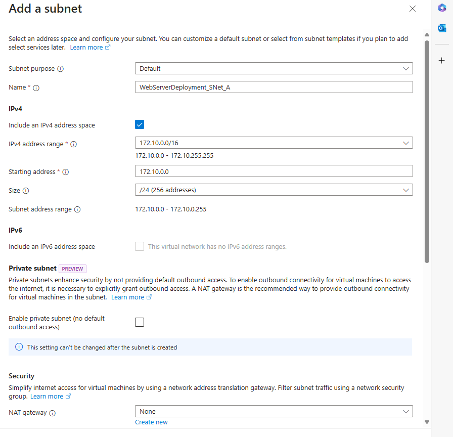
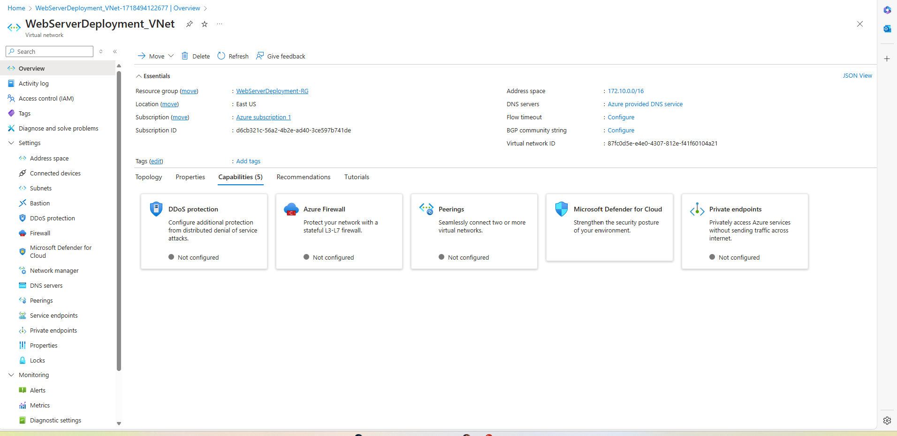
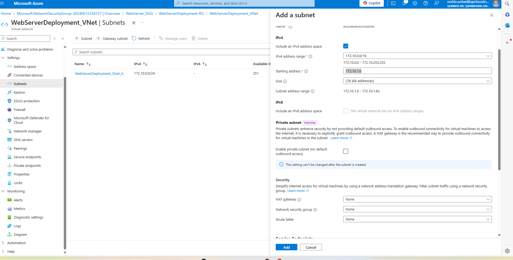
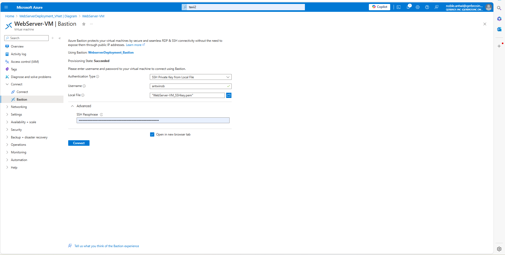
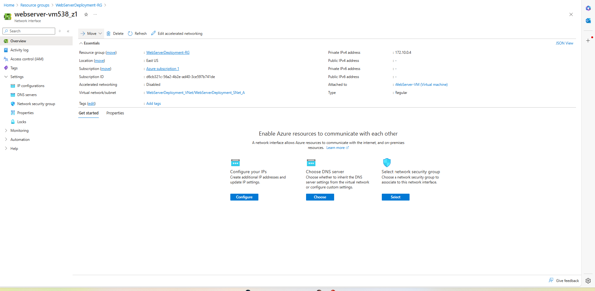
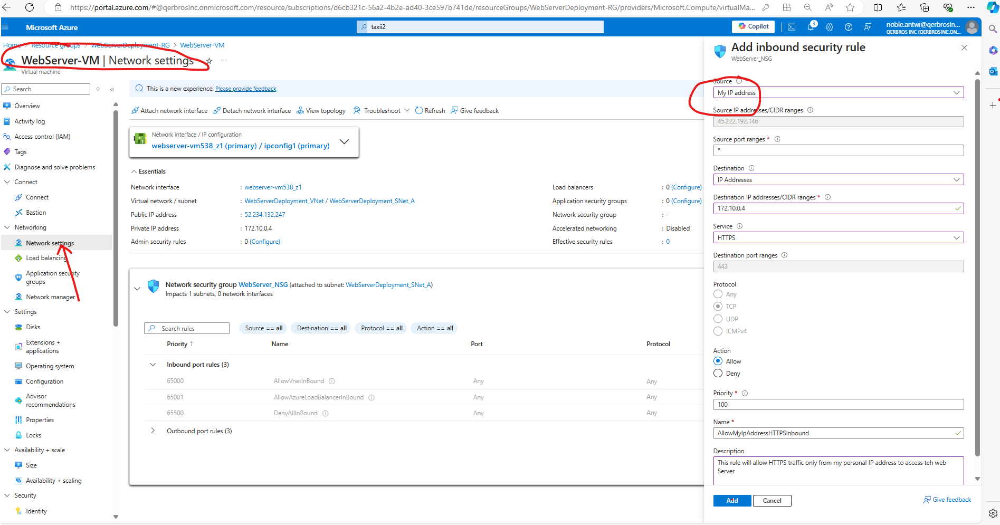
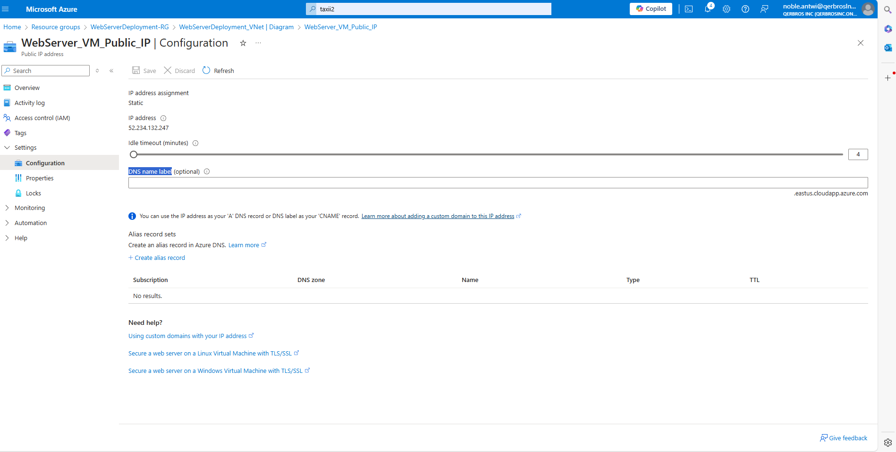

# Deploying a Web Server on an Azure Virtual Machine

## Welcome!

Welcome to my project on creating a Virtual Machine and deploying a web server on Azure. This project was an enlightening journey into the basics of Azure networking and virtual machine management. By the end of this write-up, you'll understand how to create and configure Virtual Networks, subnets, security groups, and Virtual Machines. You'll also learn how to use Bastion to connect to a Linux machine via SSH without exposing an external IP. Let's dive in!

## Project Objectives

The main objectives of this project were to:

1. Create a Resource Group
2. Create a Virtual Network and a subnet
3. Protect a subnet using a Network Security Group
4. Deploy Bastion to connect to a Virtual Machine
5. Create an Ubuntu Server Virtual Machine
6. Install Nextcloud by connecting via SSH using Bastion
7. Publish an IP
8. Create a DNS label

## Task 1: Create a Resource Group

First, I created a Resource Group named **WebServerDeployment-RG**. A Resource Group in Azure is a container that holds related resources for an Azure solution. It helps in managing and organizing resources, providing a logical grouping for easier management and monitoring. Resource Groups play a crucial role in Azure resource management, offering a way to manage all the related resources in a single, logical group. This is particularly helpful for large projects where resources need to be managed efficiently.


## Task 2: Create a Virtual Network and a Subnet

Next, I created a Virtual Network named **WebServerDeployment_VNet** with a CIDR block of **172.10.0.0/16**. A Virtual Network (VNet) is a representation of your own network in the cloud. Within this VNet, I created a subnet named **WebServerDeployment_SNet_A**. Virtual Networks allow various types of Azure resources, such as Azure VMs, to securely communicate with each other, the internet, and on-premises networks. 

The subnet **WebServerDeployment_SNet_A** allows for segmenting the virtual network into smaller, manageable segments. Subnets are essential for managing network traffic and applying network security policies at a granular level.





Here's a diagram of the infrastructure at this stage:


## Task 3: Protect a Subnet Using a Network Security Group

To enhance security, I added a Network Security Group (NSG) named **WebServer_NSG** to the subnet. An NSG contains security rules that allow or deny inbound network traffic to, or outbound network traffic from, several types of Azure resources. NSGs are critical for defining security policies at the network level and ensuring that only authorized traffic is allowed to reach specific resources.

By default, the NSG had the following rules:

1. **Inbound Rules:**
   - AllowVnetInBound: Allows inbound traffic from within the virtual network.
   - AllowAzureLoadBalancerInBound: Allows inbound traffic from Azure load balancers.
   - DenyAllInBound: Denies all other inbound traffic by default.
2. **Outbound Rules:**
   - AllowVnetOutBound: Allows outbound traffic to other resources in the virtual network.
   - AllowInternetOutBound: Allows outbound traffic to the internet.
   - DenyAllOutBound: Denies all other outbound traffic by default.

These default rules provide a secure starting point, ensuring that no unauthorized traffic can access the network until explicit rules are created to allow necessary traffic.


The updated architecture with the NSG:


## Task 4: Deploy Bastion to Connect to a Virtual Machine

I then deployed Azure Bastion, naming it **WebserverDeployment_Bastion**. Azure Bastion provides secure and seamless RDP and SSH connectivity to your virtual machines directly through the Azure portal over SSL. This deployment included a new Public IP address named **WebServerDeployment_Bastion_IP**. Azure Bastion ensures that your VMs are not exposed to the public internet, reducing the risk of exposure to threats while providing secure connectivity.

Creating Azure Bastion involved setting up a dedicated subnet with a CIDR block of **172.10.1.0/26**. This subnet is specially designated for the Bastion host, which acts as a jump server to provide secure access to the VMs within the virtual network. The use of Azure Bastion eliminates the need to manage and secure jump boxes and public IP addresses for your VMs, simplifying your network security management.




Creating Azure Bastion required associating a new public IP and configuring it to be used specifically for the Bastion host. The name given to the Bastion host was **WebserverDeployment_Bastion**, and it was placed within the WebServerDeployment resource group and the WebServerDeployment virtual network. 


## Task 5: Create an Ubuntu Server Virtual Machine

Next, I created an Ubuntu Server Virtual Machine. The VM was set up with the following specifications:

- **Name:** WebServer-VM
- **Region:** East US
- **Availability Zone:** Zone 1
- **Image:** Ubuntu Pro 18.04 LTS
- **Size:** Standard_B1ls (1 vcpu, 0.5 GiB memory)
- **Username:** antwinob
- **SSH Key:** Generated during the setup

Ubuntu Pro 18.04 LTS is a long-term support version of the popular Ubuntu operating system, providing stability and security updates for an extended period. The chosen VM size, Standard_B1ls, is suitable for small workloads and testing environments, offering a cost-effective option for this project.


### Connecting to the VM via Bastion

Using Bastion, I connected to the VM, ensuring secure access without exposing the VM to the public internet. This secure connectivity is crucial for managing VMs in a production environment, where minimizing exposure to potential threats is a priority.



The successful connection to the VM via Bastion was confirmed, providing a secure channel for managing the VM and installing necessary applications.


## Task 6: Install Nextcloud by Connecting via SSH Using Bastion

I installed Nextcloud on the VM. Nextcloud is a suite of client-server software for creating and using file hosting services. It is a popular self-hosted solution for cloud storage. Nextcloud provides functionalities similar to Dropbox or Google Drive but gives you complete control over your data.

Nextcloud offers file synchronization, sharing, and collaboration features, making it an ideal solution for personal and business use. It supports a wide range of applications and integrations, enhancing its functionality beyond just file storage. With Nextcloud, you can manage calendars, contacts, emails, and much more, all within a single, secure platform.

To install Nextcloud, I used the following commands:

```bash
sudo snap install nextcloud
```
Then, I created the admin user and enabled HTTPS:

```bash
sudo nextcloud.manual-install <username> <password>
sudo nextcloud.enable-https self-signed
```

These commands installed Nextcloud, created an administrative user, and configured the server to use HTTPS with a self-signed certificate. Using HTTPS ensures that data transmitted between the client and server is encrypted, providing an additional layer of security.

## Task 7: Publish an IP
I then associated a Public IP address with the VM's network interface to make the web server accessible publicly. The IP address assigned was 52.234.132.247. Associating a public IP address allows external users to access the services hosted on the VM, such as the Nextcloud application.


The process of associating the public IP involved configuring the network interface of the VM. This step was crucial to ensure that the web server could be accessed from the internet.


The VM was now assigned a public IP address, making it accessible from the internet.


Since the NSG did not allow inbound HTTPS traffic, I added a rule to permit HTTPS traffic. This step was necessary to allow secure connections to the Nextcloud web server from external users.


The new inbound rule was configured to allow HTTPS traffic from my IP address initially. This approach ensures that only authorized users can access the server while configuring and testing.





# Task 8: Create a DNS Label

To access the server through a friendly name, I created a DNS label qerbros, resulting in the DNS name **qerbros.eastus.cloudapp.azure.com**. Creating a DNS label provides an easier way to access the web server instead of using the IP address. This is particularly useful for users and applications that need to connect to the server.


The DNS label qerbros was successfully created, providing a user-friendly domain name for accessing the web server.


Finally, I updated Nextcloud's trusted domains configuration to include the new DNS name:

```bash
sudo nextcloud.occ config:system:set trusted_domains 1 --value=qerbros.eastus.cloudapp.azure.com
```

Updating the trusted domains configuration ensures that Nextcloud recognizes requests coming from the new DNS name, preventing potential security issues related to domain spoofing.


The site was now accessible via the DNS endpoint:


The successful configuration of the DNS label and updating Nextcloud's trusted domains meant that users could now access the Nextcloud application using a friendly domain name.


## Conclusion
This project provided a hands-on experience with Azure's powerful features for deploying and managing virtual networks and machines. By the end, I successfully deployed a web server with Nextcloud on an Azure VM, ensuring secure and accessible cloud storage. The journey involved setting up a resource group, creating and configuring a virtual network and subnets, securing the network with a Network Security Group, deploying and connecting to a VM using Azure Bastion, installing Nextcloud, and configuring a public IP and DNS label for user-friendly access.

This project demonstrated the importance of secure network configuration and management in the cloud, highlighting best practices for deploying web applications securely. The use of Azure Bastion and Network Security Groups ensured that the VM was protected from unauthorized access, while the DNS configuration improved accessibility and usability for end-users.